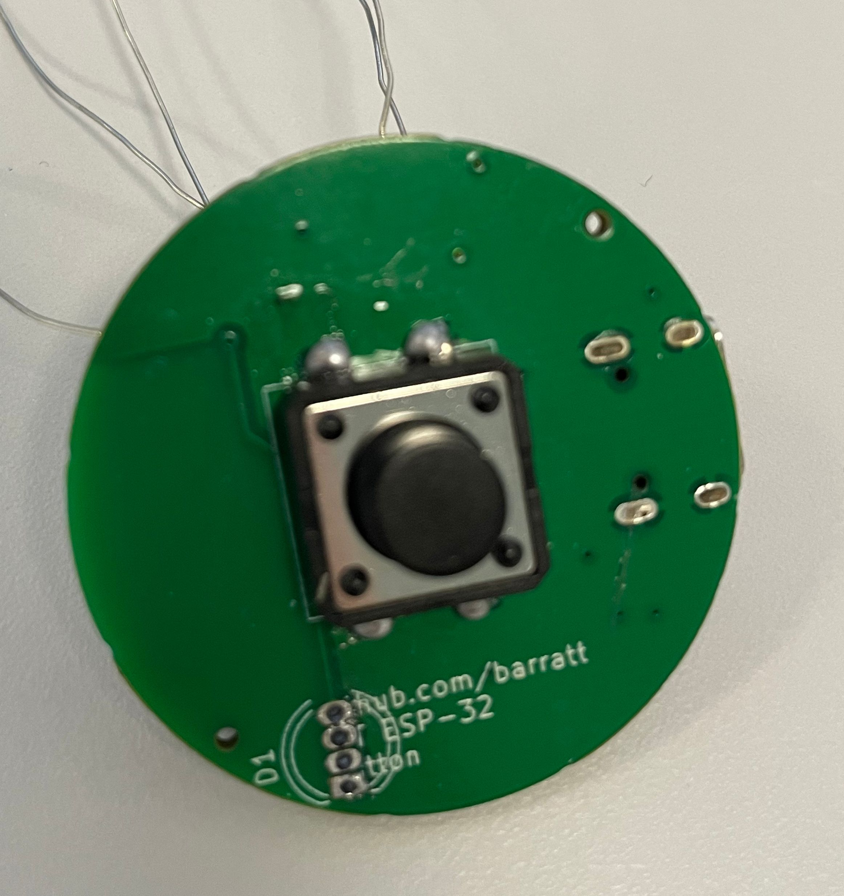
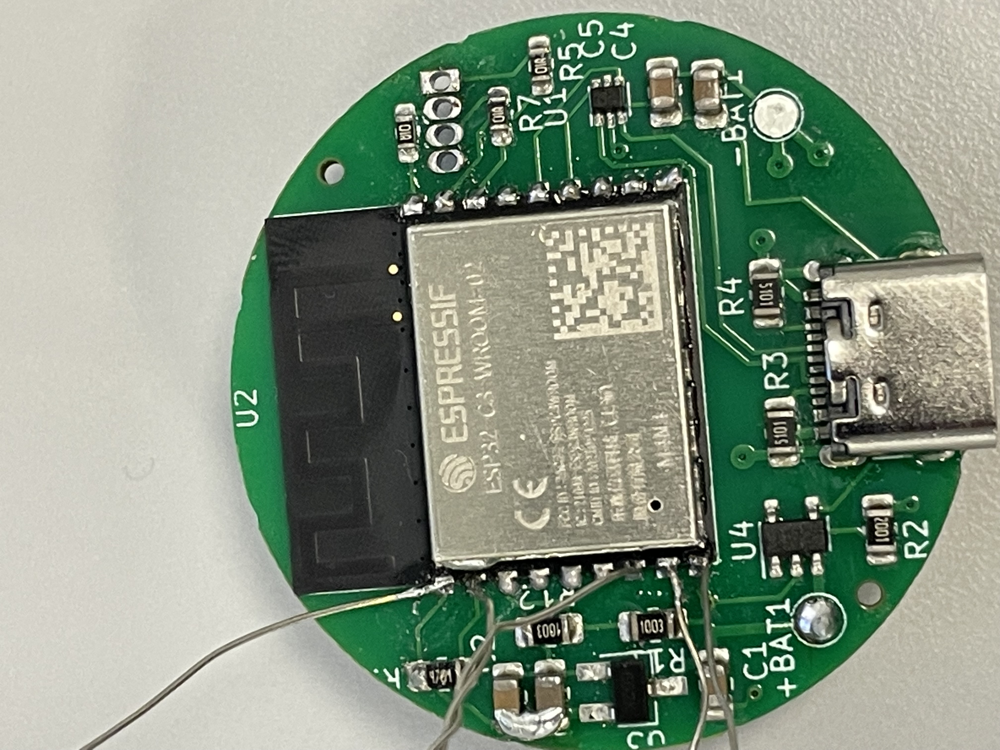

I was looking for a simple small ESP32 that could be used as a desktop or portable IOT button.

The rationale behind not using Zigbee or BLE was simplicity & cost for the end user. It can either be connected via type C to a PC or through WiFi using a battery.

If you're looking to build one, I sent everything in the gerbers folder to JLCPCB and paid for SMD assembly. In total I paid £20 for 5 boards, so £4 per button overall. The button and LED needs soldering by hand, however since they're the biggest components, this is easy.

You can see a full bom in the gerbers folder.

Some issues that need addressing:

- The capacitors on the 3.3v line feeding the ESP are not connected. (I fixed this after using a blob of solder)
- The battery charging module does not output sufficient current with no battery connected - which means the LDO regulator does not get enough power to supply the ESP32.
This can be solved by adding 2 low drop diodes to the schematic, or just removing the battery charging and soldering the LDO input to 5v (like I did in a bodge).
- The RGB LED connector is untested - I didn't need this 
- There are no jumpers / test points to put the ESP into programming mode. As such you'll need to solder leads to the ESP directly and remove them after flashing, as shown in the images below.

It's unlikely I'll come back to the project as it solves my requirements, so if you do fix any of the above please submit a pull request, otherwise do what you like with this!

